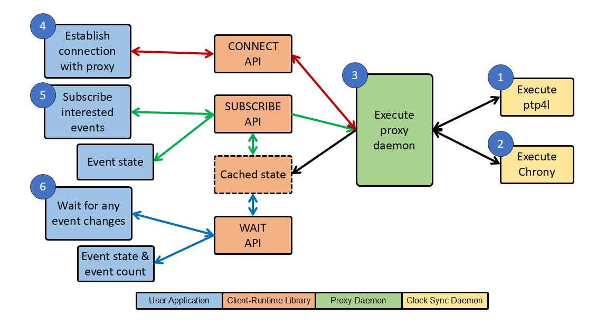

<!-- SPDX-License-Identifier: GFDL-1.3-no-invariants-or-later
     SPDX-FileCopyrightText: Copyright © 2024 Intel Corporation. -->
# How to get Linux PTP

You can install it from your Linux distribution:  
NOTE: The linuxptp must be version 4.4 and above.  
On Ubuntu and Debian:  
```bash
sudo apt install linuxptp
```  
On Fedora:  
```bash
dnf install linuxptp
```

Or get it from [linuxptp](https://linuxptp.nwtime.org/) site.

# How to get Chrony

1. Install Chrony (If Chrony is already pre-installed, please skip this step):  
    On Ubuntu and Debian:  
    ```bash
    sudo apt install chrony
    ```  
    On Fedora:  
    ```bash
    dnf install chrony
    ```

# How to get Clock Manager together with libptpmgmt

1. Install package dependencies:  
    ```bash
    sudo apt install swig libtool-bin cppcheck doxygen ctags astyle dot epstopdf valgrind
    ```

1. Install Real-Time Priority Inheritance Library (librtpi):  
    On new Ubuntu and Debian systems:  
    ```bash
    sudo apt install librtpi-dev
    ```  
    On older systems, build and install the library:  
    ```bash
    git clone https://github.com/linux-rt/librtpi.git  
    cd librtpi  
    autoreconf --install  
    ./configure  
    make  
    sudo make install
    ```

1. Install libchrony:  
    ```bash
    git clone https://gitlab.com/chrony/libchrony.git  
    cd libchrony  
    make  
    sudo make install prefix=/usr/local DESTDIR=  
    ldconfig
    ```

1. Install Clock Manager:  
    ```bash
    git clone https://github.com/erezgeva/libptpmgmt  
    cd libptpmgmt  
    autoreconf -i  
    ./configure  
    make  
    sudo make install
    ```

1. Outcome of Step 4: two libraries and one application  
    ```bash
    .libs/libptpmgmt.so  
    .libs/libclkmgr.so  
    clkmgr/proxy/clkmgr_proxy
    ```

# How to Build the Sample Application

We provided C/C++ sample applications to showcase how to use
Clock Manager API to track the latest status of ptp4l and Chrony.
The applications are provided for demonstration only.
We do not recommend to use them for production.

1. Navigate to the sample directory:  
    ```bash
    cd libptpmgmt/clkmgr/sample
    ```

1. Build the application:  
    ```bash
    make
    ```

1. Outcome: two binary  
    ```bash
    clkmgr_test  
    clkmgr_c_test
    ```

# How to Test

Operation Flow of Clock Manager:

  
__Figure 1 - Operation Flow of Clock Manager__

# Test Steps

1. For Multi Domain users need to create vclock in order to support multi-domain:  
    Create vclock:  
    ```bash
    echo <number of vclock> > /sys/class/net/<interface name>/device/ptp/<ptp pin>/n_vclocks
    ```  
    Ensure the vclock is created successfully:  
    ```bash
    udevadm info /dev/ptp*
    ```

1. Run the ptp4l services on both DUT and link partner:  
    Before starting ptp4l services, user needs to prepare the configuration file
    accordingly.  
    There are two types of ptp4l service, which are ptp4l CMLDS service
    and ptp4l domains service. Each type of service has its own set of
    configuration files.  
    Below are some MUST-HAVE parameters examples that are needed
    specifically for Clock Manager:

    a. Example of ptp4l CMLDS service's configuration:  
    ```bash
    clientOnly                      1  
    delay_mechanism                 P2P  
    free_running                    1  
    follow_up_info                  1  
    transportSpecific               2  
    clockIdentity                   000001.0000.800000  
    phc_index                       4  
    uds_address                     /var/run/master-cmlds
    ```

    b. Example of ptp4l domains service's configuration:  
    ```bash
    delay_mechanism            P2P  
    follow_up_info             1  
    transportSpecific          1  
    clockIdentity              000001.0000.000001  
    cmlds.server_address       /var/run/master-cmlds  
    cmlds.client_address       /var/run/master-client-0  
    domainNumber               0  
    phc_index                  4  
    uds_address                /var/run/ptp4l-domain-0
    ```

    Note:  
    For multi-domain, ptp4l needs to run the CMLDS service.  
    Run the ptp4l CMLDS service on both DUT and link partner:  
    ```bash
    sudo ptp4l -i <interface name> -f <cmlds config file> -m
    ```  
    Run the ptp4l domains service on both DUT and link partner:  
    ```bash
    sudo ptp4l -i <interface name> -f <domain config file> -m
    ```

1. Add ptp device (e.g. /dev/ptp0) as refclock for Chrony daemon application on DUT:  
    ```bash
    echo "refclock PHC /dev/ptp0 poll -6 dpoll -1" >>  /etc/chrony/chrony.conf
    ```

1. Run the Chrony daemon application on DUT:  
    ```bash
    chronyd -f /etc/chrony/chrony.conf
    ```

1. Run the clkmgr_proxy application on DUT:  
    For how to prepare the proxy configuration file, refer to [sample](./proxy/proxy_cfg.json)  
    ```bash
    cd libptpmgmt/clkmgr/proxy  
    sudo ./run_proxy.sh
    ```

1. Run the sample application on DUT:  
    There are 3 modes in multi-domain:
    1. Default Mode: In default mode, the sample application will directly
                     subscribes to time base index 1.
    1. Subscribe All Mode (-a): In this mode, the sample application will
                                subscribe to all available time bases.
    1. User Prompt Mode (-p): In this mode, the sample application will prompt
                              user to subscribe up to multiple time bases.

    a. C++ sample application:  
    ```bash
    cd libptpmgmt/clkmgr/client  
    sudo ./run_clkmgr_test.sh <optional arguments>
    ```

    b. C sample application:  
    ```bash
    cd libptpmgmt/clkmgr/client  
    sudo ./run_clkmgr_c_test.sh <optional arguments>
    ```

# Examples of Result

Usage of proxy daemon (clkmgr_proxy):  
```bash  
~/libptpmgmt/clkmgr/proxy# ./run_proxy.sh -h  
Usage of ./clkmgr_proxy:  
Options:  
 -f [file] Read configuration from 'file'  
 -l <lvl> Set log level  
          0: ERROR, 1: INFO(default), 2: DEBUG, 3: TRACE  
 -v <0|1> Enable or disable verbose output  
          0: disable, 1: enable(default)  
 -s <0|1> Enable or disable system log printing  
          0: disable(default), 1: enable  
 -h       Show this help message
```

Usage of c++ sample application (clkmgr_test):  
```bash  
~/libptpmgmt/clkmgr/sample# ./run_clkmgr_test.sh -h  
Usage of ./clkmgr_test :  
Options:  
  -a subscribe to all time base indices  
     Default: timeBaseIndex: 1  
  -p enable user to subscribe to specific time base indices  
  -s subscribe_event_mask  
     Default: 0xf  
     Bit 0: eventGMOffset  
     Bit 1: eventSyncedToGM  
     Bit 2: eventASCapable  
     Bit 3: eventGMChanged  
  -c composite_event_mask  
     Default: 0x7  
     Bit 0: eventGMOffset  
     Bit 1: eventSyncedToGM  
     Bit 2: eventASCapable  
  -u gm offset upper limit (ns)  
     Default: 100000 ns  
  -l gm offset lower limit (ns)  
     Default: -100000 ns  
  -i idle time (s)  
     Default: 1 s  
  -m chrony offset upper limit (ns)  
     Default: 100000 ns  
  -n chrony offset lower limit (ns)  
     Default: -100000 ns  
  -t timeout in waiting notification event (s)  
     Default: 10 s
```

Result for `Subscribe All Mode (-a)`:  
```bash
~/libptpmgmt/clkmgr/sample# ./run_clkmgr_test.sh -l 0 -u 100 -t 0 -a  
[clkmgr] set subscribe event : 0xf  
[clkmgr] set composite event : 0x7  
GM Offset upper limit: 100 ns  
GM Offset lower limit: 0 ns  
Chrony Offset upper limit: 100000 ns  
Chrony Offset lower limit: -100000 ns

[clkmgr] List of available clock:  
TimeBaseIndex: 1  
timeBaseName: Global Clock  
interfaceName: eth0  
transportSpecific: 1  
domainNumber: 0

TimeBaseIndex: 2  
timeBaseName: Working Clock  
interfaceName: eth1  
transportSpecific: 1  
domainNumber: 20

Subscribe to time base index: 1  
[clkmgr][344584.100] Obtained data from Subscription Event:  
[clkmgr] Current Time of CLOCK_REALTIME: 1742923371187240156 ns  
|---------------------------|------------------------|  
| Event                     | Event Status           |  
|---------------------------|------------------------|  
| offset_in_range           | 1                      |  
| synced_to_primary_clock   | 1                      |  
| as_capable                | 1                      |  
| gm_Changed                | 1                      |  
|---------------------------|------------------------|  
| GM UUID                   | 000001.0000.000000     |  
| clock_offset              | 8                   ns |  
| notification_timestamp    | 1742923371187204125 ns |  
|---------------------------|------------------------|  
| composite_event           | 1                      |  
| - offset_in_range         |                        |  
| - synced_to_primary_clock |                        |  
| - as_capable              |                        |  
|---------------------------|------------------------|

|---------------------------|------------------------|  
| chrony_offset_in_range    | 1                      |  
|---------------------------|------------------------|  
| chrony_clock_offset       | 23                  ns |  
| chrony_clock_reference_id | 50484330               |  
| chrony_polling_interval   | 500000              us |  
|---------------------------|------------------------|

Subscribe to time base index: 2  
[clkmgr][344584.100] Obtained data from Subscription Event:  
[clkmgr] Current Time of CLOCK_REALTIME: 1742923371187340099 ns  
|---------------------------|------------------------|  
| Event                     | Event Status           |  
|---------------------------|------------------------|  
| offset_in_range           | 1                      |  
| synced_to_primary_clock   | 1                      |  
| as_capable                | 1                      |  
| gm_Changed                | 1                      |  
|---------------------------|------------------------|  
| GM UUID                   | 000002.0000.000000     |  
| clock_offset              | 4                   ns |  
| notification_timestamp    | 1742923371187322215 ns |  
|---------------------------|------------------------|  
| composite_event           | 1                      |  
| - offset_in_range         |                        |  
| - synced_to_primary_clock |                        |  
| - as_capable              |                        |  
|---------------------------|------------------------|

|---------------------------|------------------------|  
| chrony_offset_in_range    | 0                      |  
|---------------------------|------------------------|  
| chrony_clock_offset       | 0                   ns |  
| chrony_clock_reference_id | 0                      |  
| chrony_polling_interval   | 0                   us |  
|---------------------------|------------------------|

[clkmgr][344585.100] Waiting Notification from time base index 1 ...  
[clkmgr][344585.100] Obtained data from Notification Event:  
[clkmgr] Current Time of CLOCK_REALTIME: 1742923372187493243 ns  
|---------------------------|--------------|-------------|  
| Event                     | Event Status | Event Count |  
|---------------------------|--------------|-------------|  
| offset_in_range           | 1            | 4           |  
| synced_to_primary_clock   | 1            | 0           |  
| as_capable                | 1            | 0           |  
| gm_Changed                | 0            | 0           |  
|---------------------------|--------------|-------------|  
| GM UUID                   |     000001.0000.000000     |  
| clock_offset              |     4                   ns |  
| notification_timestamp    |     1742923372085217302 ns |  
|---------------------------|--------------|-------------|  
| composite_event           | 1            | 4           |  
| - offset_in_range         |              |             |  
| - synced_to_primary_clock |              |             |  
| - as_capable              |              |             |  
|---------------------------|--------------|-------------|

|---------------------------|----------------------------|  
| chrony_offset_in_range    | 1            | 0           |  
|---------------------------|----------------------------|  
| chrony_clock_offset       |     -51                 ns |  
| chrony_clock_reference_id |     50484330               |  
| chrony_polling_interval   |     500000              us |  
|---------------------------|----------------------------|

[clkmgr][344585.100] sleep for 1 seconds...

[clkmgr][344585.249] Waiting Notification from time base index 2 ...  
[clkmgr][344585.249] Obtained data from Notification Event:  
[clkmgr] Current Time of CLOCK_REALTIME: 1742923372336262939 ns  
|---------------------------|--------------|-------------|  
| Event                     | Event Status | Event Count |  
|---------------------------|--------------|-------------|  
| offset_in_range           | 1            | 4           |  
| synced_to_primary_clock   | 1            | 0           |  
| as_capable                | 1            | 0           |  
| gm_Changed                | 0            | 0           |  
|---------------------------|--------------|-------------|  
| GM UUID                   |     000002.0000.000000     |  
| clock_offset              |     1                   ns |  
| notification_timestamp    |     1742923372318247718 ns |  
|---------------------------|--------------|-------------|  
| composite_event           | 1            | 4           |  
| - offset_in_range         |              |             |  
| - synced_to_primary_clock |              |             |  
| - as_capable              |              |             |  
|---------------------------|--------------|-------------|

|---------------------------|----------------------------|  
| chrony_offset_in_range    | 0            | 0           |  
|---------------------------|----------------------------|  
| chrony_clock_offset       |     0                   ns |  
| chrony_clock_reference_id |     0                      |  
| chrony_polling_interval   |     0                   us |  
|---------------------------|----------------------------|  
```

Note:  
```
In the absence of a primary clock (GM), the clock offset defaults to 0, which
it's anticipated that the offset_in_range event will be TRUE. Consequently,
the synced_to_primary_clock event is used to ensure that the offset_in_range
event indicates either a high-quality clock synchronization (in-sync) or that
the primary clock is not present (out-of-sync).
```
